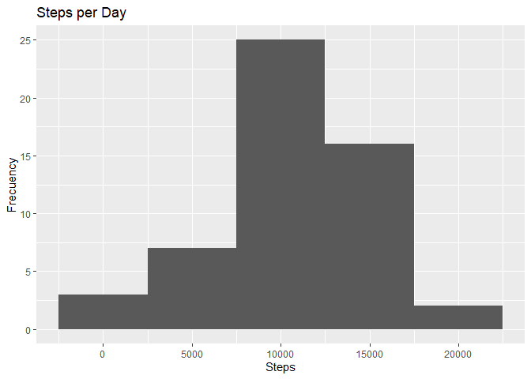
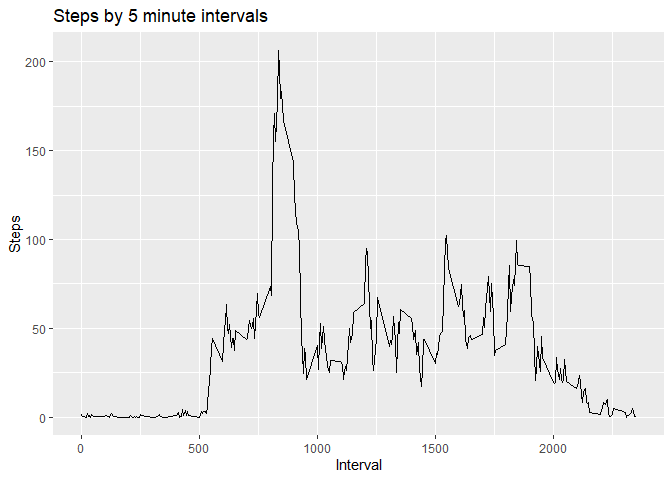
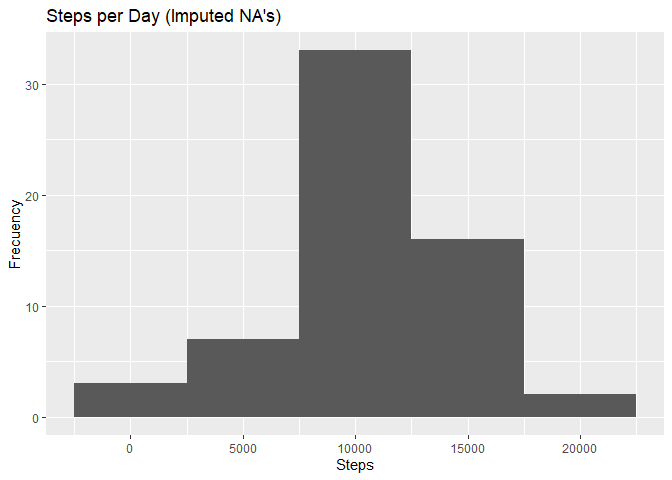
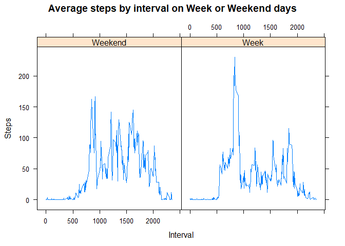

## Loading and preprocessing the data

```r
unzip("activity.zip")  ##Unzip file
data <- read.csv("activity.csv") ##Load csv data
library(lubridate)
```

```
## 
## Attaching package: 'lubridate'
```

```
## The following objects are masked from 'package:base':
## 
##     date, intersect, setdiff, union
```

```r
data$date <- ymd(data$date)      ##Convert to Date object
```


## What is mean total number of steps taken per day?

```r
stepsperday <- aggregate(steps~date,data=data,sum) ##Summarize steps by day
library(ggplot2)
qplot(stepsperday$steps,geom="histogram",binwidth=5000, main="Steps per Day", xlab="Steps", ylab="Frecuency")  ##Plot histogram
```

<!-- -->

```r
smean <- mean(stepsperday$steps)  ##Calculate values
smedian <- median(stepsperday$steps)
```

About the number of steps per day, the mean is 10766 and the median is
10765.


## What is the average daily activity pattern?

```r
timeseries <- aggregate(steps ~ interval, data=data, mean) ##Calculate mean of steps by interval
with(timeseries,qplot(x=interval,y=steps,geom="line",xlab="Interval",
                      ylab="Steps",main="Steps by 5 minute intervals"))
```

<!-- -->

```r
##Plot
maxint <- with(timeseries,interval[steps==max(steps)])  ##Search interval with max steps count
```
The interval with max number of steps in the day is 835.


## Imputing missing values

```r
nincomplete <- sum(!complete.cases(data))
```
Number of incomplete rows: 2304.

For imputing missing values, impute the mean value for steps by same intervals.

```r
impute <- function(df){
  for(i in seq(1,nrow(df))){
    if(is.na(df[i,1])){
      df[i,1] <- timeseries$steps[timeseries$interval==df[i,3]]
    }
  }
  df
}

idata <- impute(data)
```

Plot histogram...

```r
istepsperday <- aggregate(steps~date,data=idata,sum)
qplot(istepsperday$steps,geom="histogram",binwidth=5000, main="Steps per Day (Imputed NA's)", xlab="Steps", ylab="Frecuency")
```

<!-- -->

```r
ismean <- mean(istepsperday$steps)
ismedian <- median(istepsperday$steps)
```
About the number of steps per day, now with imputed values, the mean is 10766 and the median is
10766. The shape of the histogram is the same, but the values era bit higher.

## Are there differences in activity patterns between weekdays and weekends?

```r
library(dplyr)
```

```
## 
## Attaching package: 'dplyr'
```

```
## The following objects are masked from 'package:stats':
## 
##     filter, lag
```

```
## The following objects are masked from 'package:base':
## 
##     intersect, setdiff, setequal, union
```

```r
library(lattice)
idata <- mutate(idata,weekday=weekdays(idata$date))
idata <- mutate(idata,Temp = factor(idata$weekday,labels=c("Weekend","Week","Week","Week","Week","Weekend","Week")))
idata <- aggregate(steps ~ interval+Temp, data=idata, mean)
with(idata,xyplot(steps~interval |Temp,type="l",main="Average steps by interval on Week or Weekend days",ylab="Steps",xlab="Interval"))
```

<!-- -->

